# Supply Chain Full Stack Application

This application is designed to streamline company listings and enhance user experience. It provides detailed pages with integrated maps for better visualization and offers insightful analysis based on company data, facilitating informed decision-making.

## Features

- **Company Listings**: View a list of companies with search functionality.
- **Company Details**: View detailed information about a company, including its locations.
- **Map Integration**: Visualize company locations on an interactive map with different views (normal, polygon, user location, and routing).
- **Routing and Distance Calculation**: Calculate and display routes from the user's location to the nearest company branch.
- **Charts and Analytics**: View charts displaying company data for better analysis.

## Technologies Used

- **Frontend**: React, React Router, Material-UI, Leaflet, Vite
- **Backend**: FastAPI, Pandas, Geopy
- **Database**: CSV files
- **Containerization**: Docker

## Prerequisites

- Node.js and npm/yarn
- Python 3.x
- Docker (for containerized deployment)

## Installation and Setup

### Running Locally

#### Frontend

1. **Navigate to the frontend directory**:
   ```bash
   cd frontend

2. **Install dependencies:**:
   ```bash
   npm install

3. **Start the frontend server with Vite:**:
   ```bash
   npm run dev


#### The frontend application will be running on http://localhost:5173.

#### Backend

1. **Navigate to the backend directory:**:
   ```bash
   cd backend


2. **Create a virtual environment and activate it:**:
   ```bash
   python -m venv venv
   source venv/bin/activate  # On Windows use `venv\Scripts\activate`


3. **Install dependencies:**:
   ```bash
   pip install -r requirements.txt

4. **Start the backend server:**:
   ```bash
   uvicorn main:app --reload

#### The backend application will be running on http://localhost:8000.

### Running with Docker
#### Building and Running Docker Containers

1. **Navigate to the root directory of the project:**:
   ```bash
   cd project-root

2. **Build the Docker images:**:
   ```bash
   docker-compose build


3. **Run the Docker containers:**:
   ```bash
   docker-compose up

#### The frontend application will be running on http://localhost:5173 and the backend application on http://localhost:8000.

## Project Structure

- `frontend`: Contains the React application.
- `backend`: Contains the FastAPI application.
- `docker-compose.yml`: Docker Compose configuration file.

## API Endpoints

- `GET /companies`: Get a list of all companies.
- `GET /companies/{company_id}`: Get details of a specific company by ID.
- `GET /companies/{company_id}/locations`: Get the list of locations for a specific company.
- `GET /companies/{company_id}/nearest_location`: Find the nearest location of a company based on the user's current location.
### **Swaager UI Documentation:** http://localhost:8000/docs#/


## Features Developed Detailed

- **Home Page**: Below is the Home page it has NavBar and HeroBanner for landing Page

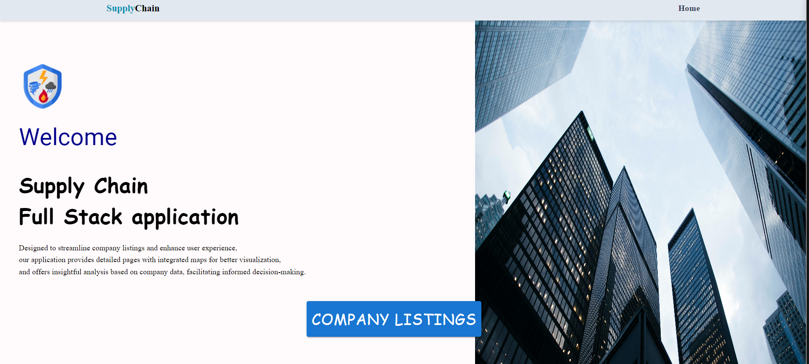
- **View Company Listings**: This is the Comapny Listing Page where we Listed all the companies present in CSV file into interactive Cards. It also has Search feature.

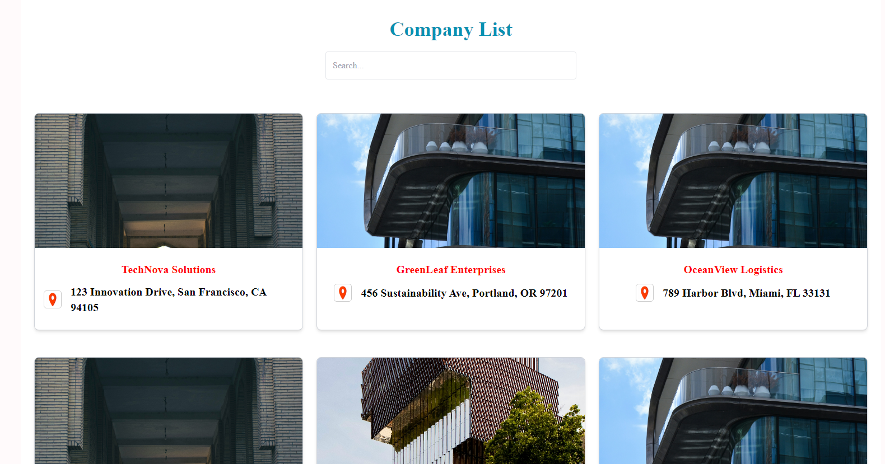
- **View Company Details**: Click on a company from the listings to view detailed information, including locations on a map.

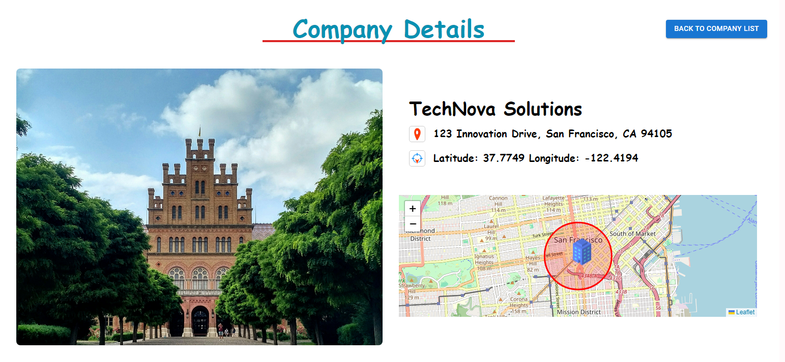
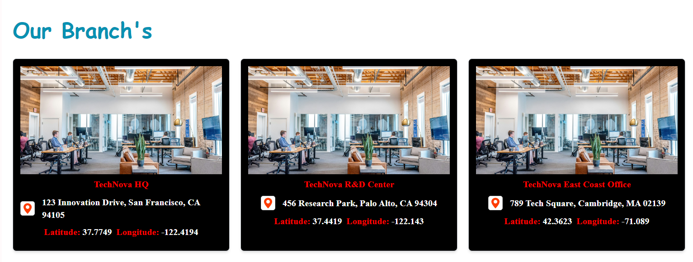
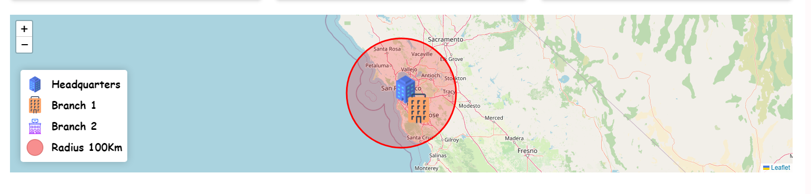

- **Chart Visualisation Details**: We have 2 Dynamic Chart which displays bar chart for Company Distribution by City.
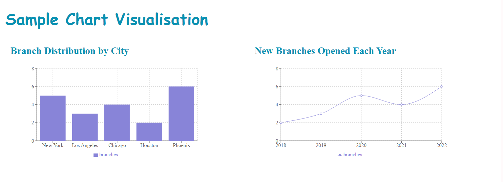

- **Map Visualisation Details**: We have 2 Dynamic Chart which displays bar chart for Company Distribution by City.
1. **Normal Map Details**: This Option Displays all the Branch's the Parent Company Available on the Map. Also Created Legend to categorize based on HeadQuarters and Branch Buildings. The Circle is the radius of 100Km around the HeadQuarters Building.

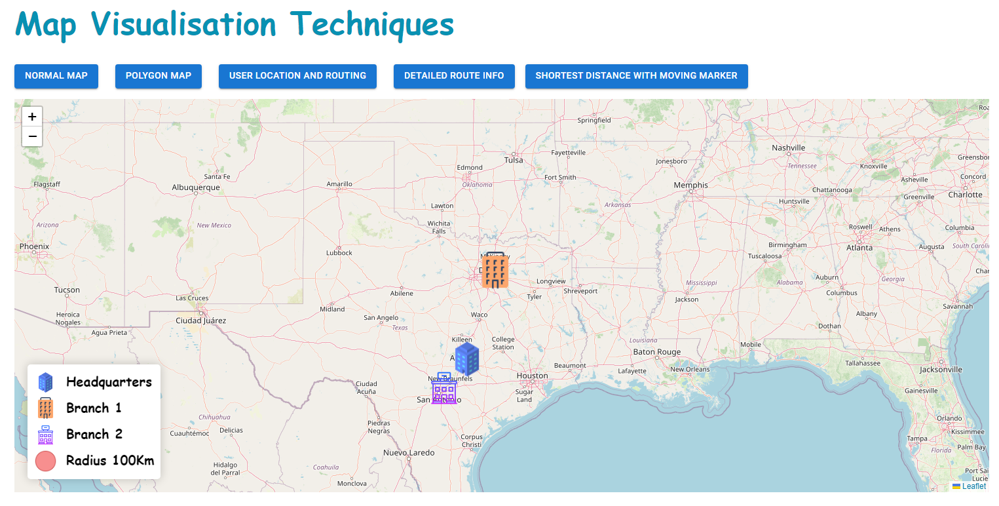

2. **Polygon Map Details**: Polygon mapping, is a geospatial technology harnessed for the creation of precise and detailed maps of specific geographic areas. These areas are delineated using GPS coordinates, giving birth to a digital representation of land boundaries of the Company Branches.

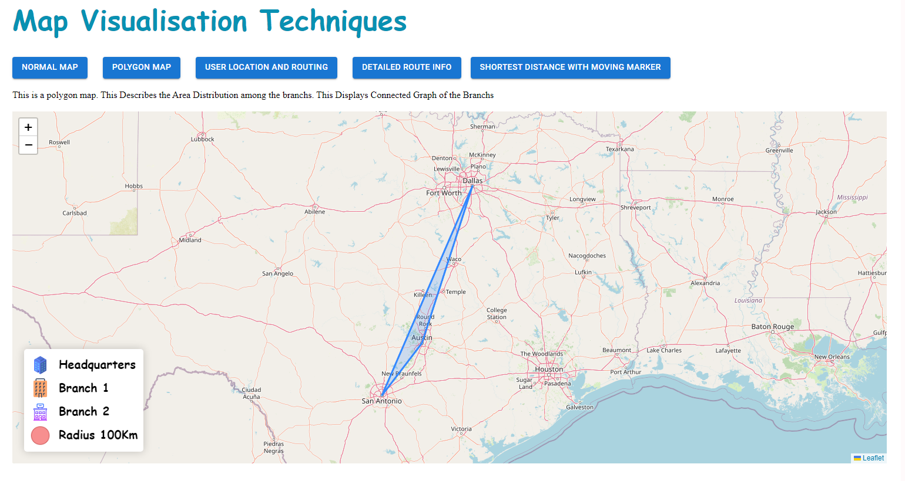

3. **User Location & Routing Details**: This Map has a Unique feature it detects the presents location of the User and when clicked in the Company Labels we can find the Complete Route Path from my Current Location to the Desised Companies Branch Location.

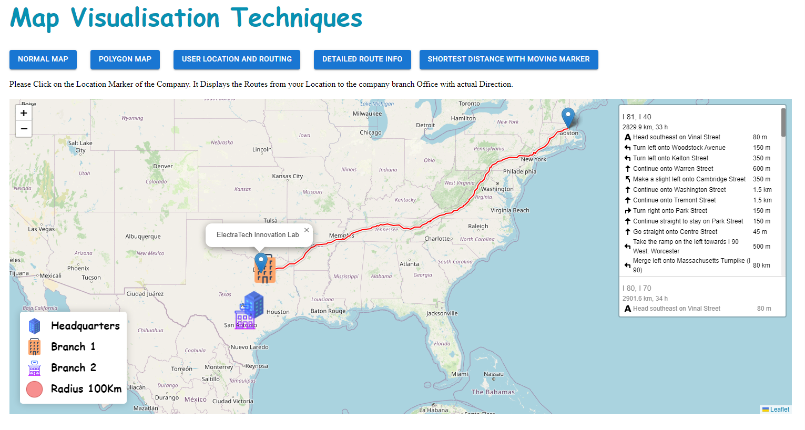

4. **Route Info Details**: This Map gives the Exact Matrix like(Distance,Time Taken (If travelled by Car), etc). These Details can give you High Level Rubics from my Current Location to Desired Branch Location. 

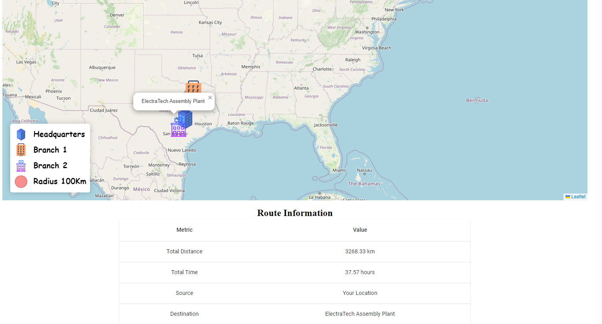

4. **Shortest Distance Map**:  This is a Unique Map Feature where you can Visualize the Nearest Brach Location for my Desired Company and a route Map to Navigate also Integrated and animation which travels Across the Route Path.

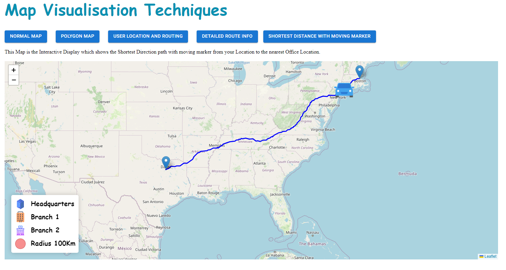


## Contributing

Contributions are welcome! Please create a pull request or open an issue for any changes or suggestions.

## License

This project is licensed under the MIT License.
